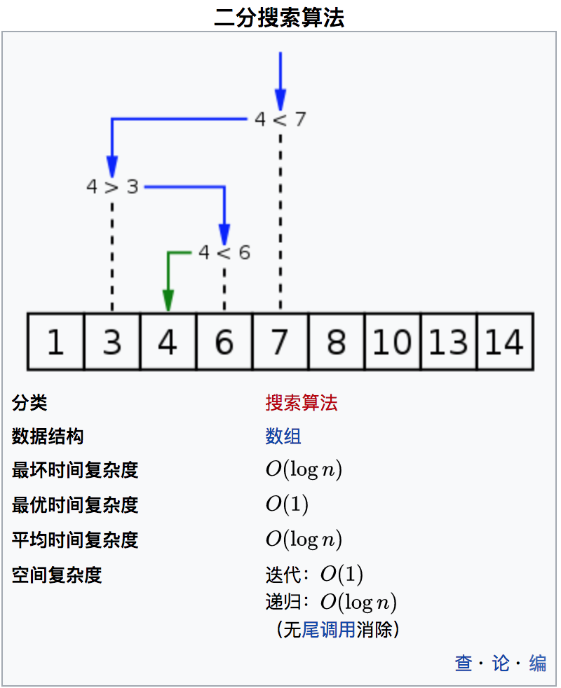

# 二分查找

二分查找即二分搜索（英语：binary search），也称折半搜索（英语：half-interval search）[1]、对数搜索（英语：logarithmic search），是一种在有序数组中查找某一特定元素的搜索算法。



## 搜索过程

从数组的中间元素开始，如果中间元素正好是要查找的元素，则搜索过程结束；如果某一特定元素大于或者小于中间元素，则在数组大于或小于中间元素的那一半中查找，而且跟开始一样从中间元素开始比较。如果在某一步骤数组为空，则代表找不到。这种搜索算法每一次比较都使搜索范围缩小一半

## 算法实现

### 递归

```js
/**
 * throttle
 * @param {*} key 要查找的目标
 * @param {*} low 可选，查找数组的起始位置，默认为0
 * @param {*} high 可选，查找数组的结束位置，默认为数组的最大索引值
 */
Array.prototype.binarySearch = function(key, low, high) {
    if (typeof low === "undefined") {
        low = 0;
    }
    if (typeof high === "undefined") {
        high = this.length - 1;
    }

    if (low > high) {
        return -1;
    }

    var mid = parseInt((high + low) / 2);
    if (this[mid] > key) {
        return this.binary_search(key, low, mid - 1);
    }
    if (this[mid] < key) {
        return this.binary_search(key, mid + 1, high);
    }
    return mid;
};
```

### 非递归

```js
/**
 * throttle
 * @param {*} key 要查找的目标
 */
Array.prototype.binarySearch = function(key) {
    var low = 0,
        high = this.length - 1;
    while (low <= high) {
        var mid = parseInt((high + low) / 2);
        if (key == this[mid]) {
            return mid;
        } else if (key > this[mid]) {
            low = mid + 1;
        } else if (key < this[mid]) {
            high = mid - 1;
        } else {
            return -1;
        }
    }
};
```
