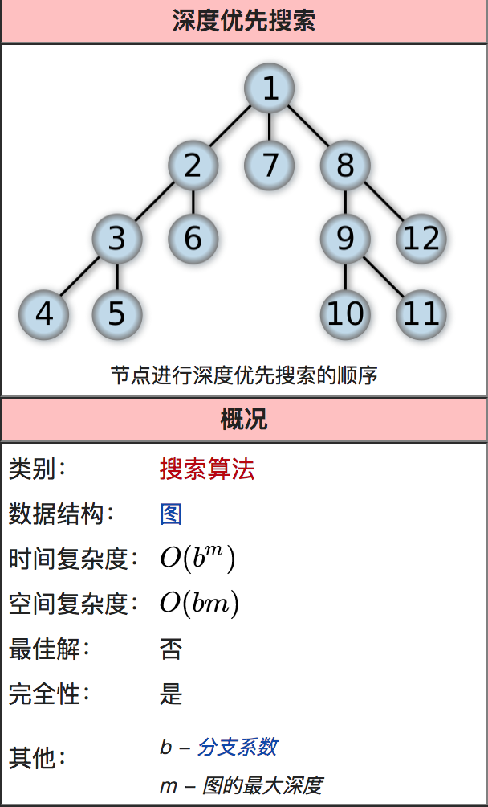

# 搜索算法

这篇文章主要介绍广度优先搜索（BFS）和 深度优先搜索（DFS）算法，它们是图／树的俩种常见的遍历算法。

## 广度优先搜索（BFS）

广度优先搜索算法（英语：Breadth-First-Search，缩写为 BFS），又译作宽度优先搜索，或横向优先搜索，是一种图形搜索算法。简单的说，BFS 是从根节点开始，沿着树的宽度遍历树的节点。如果所有节点均被访问，则算法中止。


1. 首先将根节点放入队列中。
2. 从队列中取出第一个节点，并检验它是否为目标。
3. 如果找到目标，则结束搜寻并回传结果。
4. 否则将它所有尚未检验过的直接子节点加入队列中。
5. 若队列为空，表示整张图都检查过了——亦即图中没有欲搜寻的目标。结束搜寻并回传“找不到目标”。
6. 重复步骤2。

bfs ＝队列，入队列，出队列

利用队列。

```js
//  伪代码

funtion BFS(){
    将根节点V加入队列S
    while(队列S不为空){
        从队列中取出第一个节点W，并检验它是否满足搜索条件。
        if(当前节点W满足搜索条件){
            返回当前节点
        }else{
            将W节点的相邻节点加入队列
        }
    }

    返回 '未搜索到结果'
}
```

## 深度优先搜索（DFS）

深度优先搜索算法（Depth-First-Search，简称 DFS）是一种用于遍历或搜索树或图的算法。沿着树的深度遍历树的节点，尽可能深的搜索树的分支。当节点 v 的所在边都己被探寻过，搜索将回溯到发现节点 v 的那条边的起始节点。这一过程一直进行到已发现从源节点可达的所有节点为止。如果还存在未被发现的节点，则选择其中一个作为源节点并重复以上过程，整个进程反复进行直到所有节点都被访问为止。属于盲目搜索。



> 主要思想：不撞南墙不回头。

实现步骤：

1. 首先将根节点放入队列中。

2. 从队列中取出第一个节点，并检验它是否为目标。

    如果找到目标，则结束搜寻并回传结果。

    否则将它某一个尚未检验过的直接子节点加入队列中。

3. 重复步骤 2。

4. 如果不存在未检测过的直接子节点。

    将上一级节点加入队列中。

    重复步骤 2。

5. 重复步骤 4。

6. 若队列为空，表示整张图都检查过了——亦即图中没有欲搜寻的目标。结束搜寻并回传“找不到目标”。

利用栈。dfs=栈，压栈，出栈。

```js
// 伪代码

// 栈实现
function DFS(){
    将初始节点压栈。

    While(栈非空) {

        取出栈顶点，暂时存储这个节点node_t信息。

        访问该节点，并且标示已访问。

        将栈顶元素出站。

        For(遍历node_t的相邻的未访问过的节点){
            将其入栈。
        }
    }
}

// 递归实现
function DFS(){
    // 判断是否到达终点，即是否还存在未遍历的相邻节点
    if() {
        return;
    }

    // 尝试每一个可走方向（右下左上）
    for(i=0; i<n; i++){
        // 判断是否可走,可走调用递归尝试下一步，不可走则尝试该点的其他方向
        if () {
            // 继续下一步
            DFS();
        }
    }
}
```

## Js 实现

### 树结构数据

```js
var tree = {
    name: "中国",
    children: [
        {
            name: "北京",
            children: [
                {
                    name: "朝阳群众"
                },
                {
                    name: "海淀区"
                },
                {
                    name: "昌平区"
                }
            ]
        },
        {
            name: "浙江省",
            children: [
                {
                    name: "杭州市",
                    code: 0571
                },
                {
                    name: "嘉兴市"
                },
                {
                    name: "绍兴市"
                },
                {
                    name: "宁波市"
                }
            ]
        }
    ]
};
```

### DFS 实现

```js
// 算法实现
function dfs(tree, name) {
    var stack = [];
    stack.push(tree);
    while (stack.length !== 0) {
        var current = stack[stack.length - 1];
        stack.pop();
        if (current.name === name) {
            return current;
        } else {
            current.children &&
                current.children.forEach(node => {
                    stack.push(node);
                });
        }
    }
    return null;
}

// 使用递归
function dfs(tree, name) {
    debugger;
    var result;
    if (tree.name === name) {
        result = tree;
    } else {
        var children = tree.children;
        if (children && children.length) {
            children.forEach(node => {
                result = dfs(node, name);
            });
        } else {
            result = null;
        }
    }
    return result;
}
```

### BFS 实现

```js
// 算法实现
function bfs(tree, name) {
    var queue = [];
    queue.push(tree);
    while (queue.length !== 0) {
        var current = queue[0];
        queue.shift();
        if (current.name === name) {
            return current;
        } else {
            current.children &&
                current.children.forEach((node, index) => {
                    queue.push(node);
                });
        }
    }

    return null;
}
```
